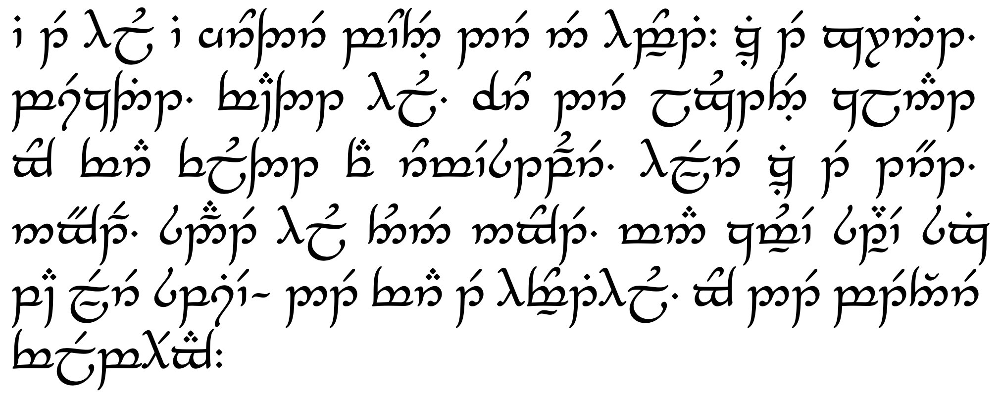

# Dansk tengwar modus - Danish tengwar mode

DK: Dette er et forslag til en dansk tengwar modus (tengwar er Tolkiens "elverbogstaver").  Filen der beskriver den danske modus er her.  Noterne er både på dansk og engelsk.

ENG: This is a suggested Danish tengwar mode (tengwar are Tolkien's "Elvish letters").  The file describing the mode is here.  The notes are both in Danish and English.

* [danmode.pdf](danmode.pdf)

## Example

## Why are modes needed?

**Why can't we just have one alphabet mapping for all languages?  Why did Tolkien introduce modes?**

Our normal alphabet also has "modes":  The sounds are different in different languages, therefore there is a different mapping between sounds and letters in each language, this is what Tolkien called modes.  For example, the letter J sounds very different in English, French and Danish.  And there are a few extra letters in some European languages, such as Danish.

## Technical notes

1. The PDF it set using LaTeX with the ``tengwarscript.sty`` style file and the Annatar font.  Installing tengwar fonts is described [here](https://github.com/nbeaver/tengwarscript-install-guide).  The ``.sty`` file is part of most LaTeX installation, at least TexLive.

   The ``tengwarscript.sty`` package does not support the inverted three-dot tetha used for the letter Æ, but fortunately the fonts contain an inverted three-dot for placement *below* the tengwa.  So it was not that hard to hack a new tetha.  This requires modifying the font configuration files, I have done it for the Annatar and Parmaite fonts, it looks less good in the popular Annatar Italic font.  In each case, I added a line to the ``.cfg`` file defining the new tetha.  I also added a line defining the command ``\TTinvertedthreedots``, it should in principle be added to ``tengwarscript.sty``, but to minimize the number of modified files I put it in the font configuration files instead.  

   If you want to use this yourself, just dump the ``.cfg`` files in the same folder as your TeX file. 
   
2.  There is a minor rendering error: With the Annatar font, the extended umbar is placed too high.  It is actually extra space below it, so in a text it will align with the rest of the line, but extra space will appear below the line.  I guess that is the kind of things that happens when you name your font after that guy!

## Sources

I have taken inspiration from the Swedish and German tengwar modes:

* ["Att skriva svenska med tengwar" by Per Lindberg](https://www.forodrim.org/daeron/teng-swe.pdf)
* German tengwar mode on [Tecendil](tecendil.com).
* ["Deutscher Tengwar-Modus" by Alexander Körschgen](https://web.archive.org/web/20140227102534/http://my.opera.com/tengwarblog/blog/tengwar-orthografischer-deutscher-tehtar-modus)
* Thanks to the nice people of /r/tengwar on Reddit.

## License

All files in this repository are placed in the public domain.

